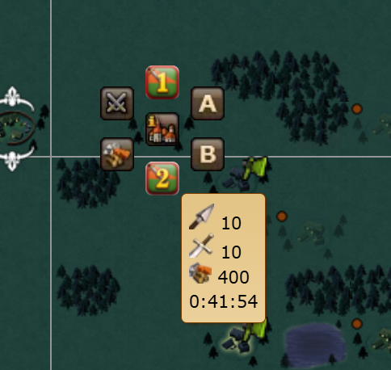
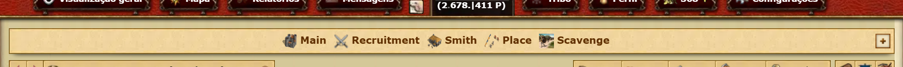
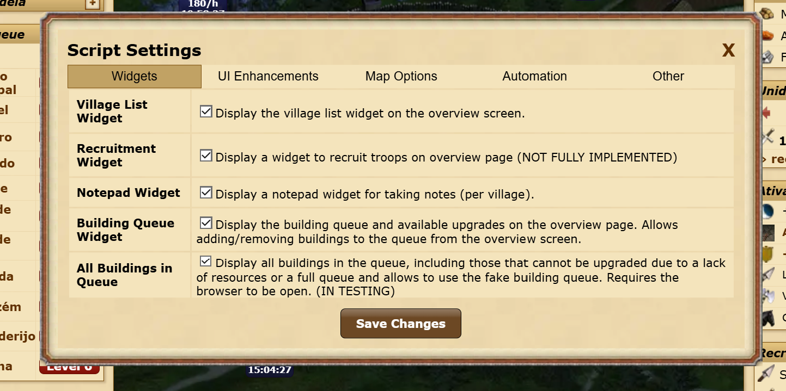

# Tribalwars: Premium Features

## Description

**Tribalwars: Premium Features** is a comprehensive enhancement suite designed to elevate the Tribalwars gaming experience by unlocking utility tools typically reserved for Premium Account holders. The script streamlines empire management by introducing a fully customizable **Extra-Large Map**, an **Infinite Building Queue** and advanced automation for routine tasks like **Scavenging** and **Paladin Training**.

To optimize your workflow, the script injects a persistent sidebar on the left side of the screen. All introduced widgets are draggable and feature **state-memory**, meaning they will remember their exact position on your screen every time you log in. Whether you are a casual player or a competitive strategist, this script provides the data transparency and one-click convenience needed to manage your villages with maximum efficiency, even without a premium account.

## Key Features

### 🗺️ Map Enhancements
- **Extra Large Map:** Enjoy a larger map without premium. Toggle it on the map page and set the size freely—no limits!
  

- **Extra Village Information on Map Hover:** Gain valuable insights with additional village information displayed on map hover. Details include the last raid performed, resources detected in the last attack, date of the last attack, and ongoing attack or return.
  

- **Direct Template Attacks from Map:** Quick-action buttons added to the map context menu to launch attacks using saved troop templates with a single click.
  

- **Outgoing Units Info on Map:** Icons added on the map to show outgoing units per village.
  

### 🏰 Village & Overview Management
- **Premium info Overview Screen:** Access additional details directly on the overview page, such as the time remaining for the storage to fill or the status of each individual resource. (In progress – replicating features typically available only to Premium users).
  
  

- **Arrows for Changing Villages:** Seamlessly navigate between villages using intuitive arrow controls.
  

- **Village List for Easy Selection:** Quickly access a comprehensive list of villages for efficient selection.
  

- **Notes for Each Village:** Stay organized by adding important notes to individual villages for easy reference.
  

- **Storage Fill Time on Resource Hover:** Monitor your resource storage effectively. Hover over the resource bar to see the estimated time remaining until wood, stone, and iron reach maximum capacity. 
  

### ⚙️ UI Customization & Settings
- **Navigation Bar:** Custom navigation bar where you can add shortcuts to various pages. Shortcuts are currently hardcoded in the script.
  

- **Remove Premium Promos:** Clean up your UI by removing advertising for premium promotions.
  
  

- **Script Settings:** Customize your experience with in-game settings to control various aspects of the script. Adjust options to suit your gameplay style.
  

### 🛠️ Building & Construction Queue
- **Building Queue Manager:** Conveniently manage your building queue from the overview page by easily adding or removing buildings without navigating through multiple menus.
  

- **Extra Building Queue (Infinite Queue):** Expands the standard queue, allowing you to schedule more than two buildings at a time—similar to the premium option. 
  - **Green**: Building is currently being upgraded.  
  - **Orange**: Waiting for the next slot (resources available).  
  - **Red**: In the "fake" queue (waiting for resources).  
  *Note: The browser must remain open for this feature to function.*
  

### 📊 Resources & Automation

- **Auto Scavenging / Paladin Train:** Automation for training the Paladin (always choosing the cheapest option) and automating Scavenging (using all available troops at the highest available level).

## How to Use

These scripts are intended for use with Tampermonkey, a popular userscript manager for web browsers.

1. **Install Tampermonkey:** If you haven't already, install the [Tampermonkey extension](https://www.tampermonkey.net/) for your web browser.
2. **Install the Script:**
   - Open Tampermonkey and navigate to the "Utilities" tab.
   - In the "Import from URL" field, paste the following link: `https://github.com/joelcosta2/Tribalwars_Script/archive/refs/heads/master.zip`.
   - Click "Install" to add the script to Tampermonkey.
3. **Import the Script:** After installation, click "Import" to import the script into Tampermonkey.

## For Those Who Want to Develop with This
1. **Download project:**
   - Download or clone the project to your local machine.
2. **Change you project file path:**
   - Edit the **main_local.user** file, and past follow settings on the file, replacing YOUR_PATH:
        ```javascript
      // @require      file://C:\{YOUR_PATH}\Tribalwars_Script\utils.user.js
      // @require      file://C:\{YOUR_PATH}\Tribalwars_Script\custom_css.user.js
      // @require      file://C:\{YOUR_PATH}\Tribalwars_Script\settings_script.user.js
      // @require      file://C:\{YOUR_PATH}\Tribalwars_Script\navigationArrows_script.user.js
      // @require      file://C:\{YOUR_PATH}\Tribalwars_Script\map_script.user.js
      // @require      file://C:\{YOUR_PATH}\Tribalwars_Script\overviewPremiumInfo.user.js
      // @require      file://C:\{YOUR_PATH}\Tribalwars_Script\bot_trainerPaladin.user.js
      // @require      file://C:\{YOUR_PATH}\Tribalwars_Script\bot_scavenging.user.js
      // @require      file://C:\{YOUR_PATH}\Tribalwars_Script\widget_villageList.user.js
      // @require      file://C:\{YOUR_PATH}\Tribalwars_Script\widget_notepad.user.js
      // @require      file://C:\{YOUR_PATH}\Tribalwars_Script\widget_extraBuildQueue.user.js
      // @require      file://C:\{YOUR_PATH}\Tribalwars_Script\widget_recruitTroops.user.js
      // @updateURL    file://C:\{YOUR_PATH}\Tribalwars_Script\1main.user.js
      // @downloadURL  file://C:\{YOUR_PATH}\Tribalwars_Script\1main.user.js

   
3. **Import the main file on Tampermonkey:**
   - Open Tampermonkey and navigate to the "Utilities" tab.
   - In the "Import from file" field, select the **main_local.user**.
   - Click "Install" to add the script to Tampermonkey.
4. **Make your changes:**
   - Edit the scripts and test them directly in your browser. You only need to reinstall the script if you make changes to the **main_local.user** file
5. **Make sure you have Allow access to file URLs for Tampermonkey(TP):**
   - Go to Extensions on your browser and find the TM 'card'.
   - Click details and "Allow access to file URLs".
   
  

6. **Notice the file:// URI scheme:**
      - for windows:

            // @require   file://C:\path\to\userscript.user.js

      - for macOS and *nix:

            // @require   file:///path/to/userscript.user.js

## Notes

- These features currently work only in the browser and have been tested with a single account/world. Support for multiple accounts or worlds may be added in the future.
- All data is stored in the browser's local storage.
- I have no idea how it works in languages other than PT-PT. Feel free to test it and let me know! :)
- I doubt it works with different time formats...
- Some information is retrieved via AJAX calls to the relevant pages. For example, village hover info (such as recent attack details) is scraped from the corresponding report page and displayed on the map.
- I know this is basically spaghetti code, but I'm having a lot of fun getting it to work. I just wish my villages weren’t constantly being conquered—it makes it hard to test this with multiple villages. Maybe I should focus more on the game and less on the script!

Enjoy the enhanced features while playing Tribalwars!


## ⚠️ Disclaimer & Warning

**Important:** Some features included in this script, specifically those involving automation (such as Auto-Scavenging, Auto-Train Paladin, and Extra Building Queue), may violate the Terms of Service (ToS) of certain TribalWars servers. 

- **Use at your own risk:** I'm are not responsible for any bans or account restrictions.
- **Fair Play:** I recommend using automation features sparingly and in a way that mimics human behavior to minimize the risk of detection.
- **Check your server rules:** Always verify the local rules of your game world regarding scripts that perform automated actions or multiple actions with a single click.